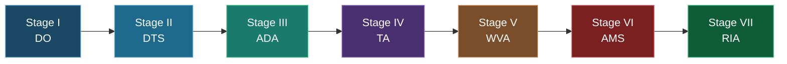

# Assessing Architectural Security in Scientific Repositories: An Action-Research Approach

<div align="center">


**A systematic application of the PASTA (Process for Attack Simulation and Threat Analysis) framework to the reBi0s scientific Big Data governance platform, conducted as action-research at UNICAMP.**

*Segurança de Dados · Engenharia de Dados · Threat Modeling · Risk-Centric Security · Action-Research*

</div>

---

## Research Team

<div align="center">

| Role | Name | Institution |
|------|------|-------------|
| **Researcher / Facilitator** | Maria Victoria Soares Fiori | UNICAMP — Instituto de Computação |
| **Advisor** | Prof. Dr. Breno Bernard Nicolau de França | UNICAMP — Instituto de Computação |
| **Co-Advisor** | Prof. Dr. José Alexandre D'Abruzzo Pereira | UNICAMP — Instituto de Computação |

**Universidade Estadual de Campinas (UNICAMP)**  
Instituto de Computação — Campinas, SP, Brazil

</div>

> **Citation:**
> Fiori, M. V. S. (2025). *Assessing Architectural Security in Scientific Repositories:
> An Action-Research Approach*. Dissertação (Mestrado) — Instituto de Computação,
> Universidade Estadual de Campinas (UNICAMP), Campinas, SP.

---

## Table of Contents

- [Overview](#overview)
- [Research Objectives](#research-objectives)
- [The PASTA Framework](#the-pasta-framework)
- [The 7 Stages of PASTA](#the-7-stages-of-pasta)
- [Methodology](#methodology)
- [Repository Structure](#repository-structure)
- [Artifact Traceability Matrix](#artifact-traceability-matrix)
- [Technologies & Tools](#technologies--tools)
- [Key Findings](#key-findings)
- [Methodological Adaptations](#methodological-adaptations)
- [Mermaid Diagrams Index](#mermaid-diagrams-index)
- [References](#references)
- [License](#license)

---

## Overview

This repository documents the complete application of the **PASTA (Process for Attack Simulation and Threat Analysis)** framework to the **reBi0s** platform — a Big Data governance and scientific data processing repository developed in the context of the BIOS project at UNICAMP.

The reBi0s platform manages sensitive scientific data across three critical domains:

| Domain | Data Type | Sensitivity Level |
|--------|-----------|-------------------|
| Health | Clinical and epidemiological records | 🔴 High |
| Climate | Atmospheric and environmental datasets | 🟡 Medium |
| Agriculture | Agricultural production and land use data | 🟡 Medium |

The threat modeling exercise was conducted following the seven-stage PASTA methodology, with adaptations appropriate to the data engineering context of the reBi0s architecture (Apache Airflow, Apache Spark, PostgreSQL, MinIO, Apache Iceberg, DataHub, Kubernetes).

---

## Research Objectives

### Primary Objective

Apply the PASTA risk-centric threat modeling methodology to the reBi0s scientific data repository, identifying, analyzing, and quantifying threats, vulnerabilities, and residual risks across all architectural components.

### Specific Objectives

- [ ] Define business objectives and security requirements (Stage I)
- [ ] Enumerate all technical components and data flows (Stage II)
- [ ] Decompose the application into interaction scenarios and Trust Boundaries (Stage III)
- [ ] Build and classify a Threat Library with 15 threats (T01–T15) (Stage IV)
- [ ] Identify and correlate vulnerabilities using static analysis (SonarQube) (Stage V)
- [ ] Model and simulate attack scenarios using CAPEC patterns (Stage VI)
- [ ] Quantify residual risk and define treatment strategies (Stage VII)

---

## The PASTA Framework

PASTA (*Process for Attack Simulation and Threat Analysis*) is a **risk-centric, seven-stage application threat modeling methodology** developed by Tony UcedaVélez (VerSprite, 2010) and formalized in:

> UcedaVélez, T. & Morana, M. M. (2015). *Risk Centric Threat Modeling: Process for Attack Simulation and Threat Analysis*. Hoboken, NJ: John Wiley & Sons.

### Core Differentiators

| Dimension | Traditional Approach | PASTA (Risk-Centric) |
|-----------|---------------------|----------------------|
| Starting point | Architecture / DFD | Business Objectives (Stage I) |
| Dominant perspective | Technical / software-centric | Business + technical + threat |
| Risk quantification | Qualitative or absent | Formula: `RS = (PV × PA × I) / C` |
| Primary output | Threat list + mitigations | Quantified residual risk profile |
| SDLC integration | Generally post-design | All SDLC phases |
| Participants | Architects / developers | Business, IT, security, GRC |

### Risk Quantification Formulas

```
Risk Score (Stage IV):
  RS = (PV × PA × I) / C

  where:
    PV = Probability of Vulnerability occurrence
    PA = Probability of Threat Agent exploiting it
    I  = Impact on CIA triad (0.1 – 1.0)
    C  = Control/Countermeasure effectiveness (0.1 – 0.9)

Residual Risk (Stage VII):
  RR = [(tp × vp) / c] × i

  where:
    tp = Threat probability
    vp = Vulnerability probability
    c  = Control effectiveness
    i  = Impact value

Risk Scale:
  Low:      [0.00 – 0.29]
  Medium:   [0.30 – 0.59]
  High:     [0.60 – 0.89]
  Critical: [0.90+]
```

---

## The 7 Stages of PASTA

```
┌─────────────────────────────────────────────────────────────────────────────┐
│                     PASTA — 7-Stage Process Overview                        │
├──────────┬──────────┬──────────┬──────────┬──────────┬──────────┬──────────┤
│ Stage I  │ Stage II │ Stage III│ Stage IV │ Stage V  │ Stage VI │ Stage VII│
│    DO    │   DTS    │   ADA    │    TA    │   WVA    │   AMS    │   RIA    │
├──────────┼──────────┼──────────┼──────────┼──────────┼──────────┼──────────┤
│Definition│Definit.  │Applicat. │ Threat   │Weakness &│ Attack   │Risk &    │
│    of    │  of the  │Decompos. │ Analysis │Vulnerab. │Modeling &│ Impact   │
│Objectives│Technical │    and   │          │ Analysis │Simulat.  │ Analysis │
│          │  Scope   │ Analysis │          │          │          │          │
├──────────┴──────────┴──────────┴──────────┴──────────┴──────────┴──────────┤
│◄── BUSINESS LAYER ──►◄────────── TECHNICAL LAYER ──────────►◄─ RISK LAYER ►│
└─────────────────────────────────────────────────────────────────────────────┘
```

### Stage I — Definition of Objectives (DO)

**Goal:** Document business objectives and security requirements that will guide the entire threat modeling process.

| Activity | Description | reBi0s Output |
|----------|-------------|---------------|
| 1.1 | Document business requirements | Scalable data governance for BIOS domains |
| 1.2 | Define security & compliance requirements | 11 security requirements (RBAC, TLS, LGPD) |
| 1.3 | Business Impact Analysis (BIA) | CIA mapping — 10 risks, majority classified as High |
| 1.4 | Define inherent risk profile | 7 risk scenarios documented |

**Key Artifacts:** [`phases/phase-1-objectives/`](./phases/phase-1-objectives/)

---

### Stage II — Definition of the Technical Scope (DTS)

**Goal:** Enumerate all technical components (hardware, software, actors, data flows) to define the initial attack surface.

**Technology Stack — reBi0s:**

| Layer | Components |
|-------|-----------|
| Governance | DataHub (metadata, access policies, data quality) |
| Orchestration | Apache Airflow (ingestion and transformation) |
| Processing | Apache Spark — Master + Workers (Spark Streaming, Spark SQL) |
| Storage | MinIO, Apache Iceberg, PostgreSQL |
| Consumption | Jupyter, Apache Superset, HUE |
| Infrastructure | Kubernetes (container orchestration) · Ansible (automation) |

> **📝 Methodological Note:** UML DFDs were replaced by **C4 Model diagrams** (System Context, Container, Component), which better represent distributed data architectures and facilitate communication between technical and business teams.

**Key Artifacts:** [`phases/phase-2-technical-scope/`](./phases/phase-2-technical-scope/) | [`docs/diagrams/`](./docs/diagrams/)

---

### Stage III — Application Decomposition and Analysis (ADA)

**Goal:** Decompose the application into interaction scenarios, data flows, and Trust Boundaries.

**Interaction Scenarios — reBi0s:**

| Scenario | Components | Trust Boundary |
|----------|-----------|----------------|
| C1 — Data Ingestion | Airflow → Spark → Iceberg/PostgreSQL | Curadoria (Airflow/Spark) |
| C2 — SQL Consumption | DataHub, HUE, Superset, PostgreSQL | Colaboração (HUE/Superset) |
| C3 — Jupyter Science | Jupyter, Superset, Spark | Colaboração (Jupyter) |
| C4 — Catalog Management | DataHub, Airflow, Iceberg | Governança (DataHub) |
| C5 — Data Quality | DataHub | Governança (DataHub) |
| C6 — Administration | Airflow, Spark, DataHub | All boundaries |

> **📝 Methodological Note:** UML Use Case and Abuse Case diagrams were replaced by **general interaction and threat scenarios**, more aligned with the data pipeline context and more effective for threat identification. These scenarios served as direct inputs to Stages IV and V.

**Key Artifacts:** [`phases/phase-3-application-decomposition/`](./phases/phase-3-application-decomposition/)

---

### Stage IV — Threat Analysis (TA)

**Goal:** Identify, classify, and map internal and external threats using OWASP Top 10 Web (2021), OWASP Data Security Top 10 (2023), and STRIDE categorization.

**Threat Library — T01 to T15:**

| ID | Type | Threat | OWASP Web | OWASP Data | STRIDE | Risk |
|----|------|--------|-----------|-----------|--------|------|
| T01 | Int/Ext | Access Control Failures | A01:2021 | DATA2:2023 | Info. Disclosure, EoP | 🔴 High |
| T02 | Int/Ext | Weak Cryptography | A02:2021 | DATA6:2023 | Info. Disclosure, Tampering | 🟡 Medium |
| T03 | External | Injection (SQL/API) | A03:2021 | DATA1:2023 | Tampering, EoP | 🔴 High |
| T04 | Internal | Software/Data Integrity Failures | A08:2021 | — | Tampering, Repudiation | 🔴 High |
| T05 | Int/Ext | Security Misconfiguration | A05:2021 | — | EoP, Info. Disclosure | 🟡 Medium |
| T06 | Internal | Vulnerable/Outdated Components | A06:2021 | — | Tampering, EoP | 🟡 Medium |
| T07 | Internal | Auth & Session Failures | A07:2021 | DATA2:2023 | Spoofing, EoP | 🟢 Low |
| T08 | Internal | Insufficient Logging & Monitoring | A09:2021 | — | Repudiation | 🟢 Low |
| T09 | External | SSRF | A10:2021 | — | Info. Disclosure | 🟡 Medium |
| T10 | Int/Ext | Malware & Ransomware | — | DATA4:2023 | DoS, Tampering | 🔴 High |
| T11 | Internal | Insider Threats | — | DATA5:2023 | Info. Disclosure | 🟡 Medium |
| T12 | Internal | Insecure Data Handling | — | DATA7:2023 | Info. Disclosure | 🟡 Medium |
| T13 | External | Inadequate Third-Party Security | — | DATA8:2023 | Spoofing, Tampering | 🟡 Medium |
| T14 | Internal | Data Inventory & Management | — | DATA9:2023 | Info. Disclosure | 🟡 Medium |
| T15 | Legal/Int | Non-Compliance (LGPD/GDPR) | — | DATA10:2023 | Repudiation, Info. Disclosure | 🟢 Low |

**Key Artifacts:** [`phases/phase-4-threat-analysis/`](./phases/phase-4-threat-analysis/) | [`artifacts/threat-modeling/`](./artifacts/threat-modeling/)

---

### Stage V — Weakness & Vulnerability Analysis (WVA)

**Goal:** Correlate real vulnerabilities identified by static analysis (SonarQube) with the Threat Library, providing contextual risk analysis per interaction scenario.

**SonarQube Analysis — 40 Unique Issues:**

| Severity | Count | Key Findings |
|----------|-------|-------------|
| 🔴 BLOCKER | 4 | Hardcoded passwords in `cm.yaml`, `conn.py`, `scripts.yaml` |
| 🟠 MAJOR | 22 | Missing CPU/RAM limits, incomplete RBAC, critical code smells |
| 🟡 CRITICAL | 10 | Duplicated literals in `loading.py` and `spark-ui-proxy.py` |
| 🟢 MINOR / BUG | 4 | Naming convention violations, self-assignment in `spark-ui-proxy.py` |

**Vulnerability → Threat Correlation:**

```
Hardcoded passwords (BLOCKER) ──────► T01 (Access Control) + T05 (Misconfiguration)
Incomplete RBAC (MAJOR) ─────────────► T01 (Access Control) + T07 (Authentication)
Missing resource limits (MAJOR) ─────► T08 (DoS/Availability)
Code integrity issues (BUG) ─────────► T04 (Software Integrity)
```

> **📝 Methodological Note:** The Attack Tree was converted into a **structured spreadsheet** (`fase_4__5_6_7.xlsx`) to facilitate analysis, traceability, incremental documentation, and to serve as input for Stages VI and VII.

**Key Artifacts:** [`phases/phase-5-vulnerability-analysis/`](./phases/phase-5-vulnerability-analysis/) | [`artifacts/attack-trees/`](./artifacts/attack-trees/)

---

### Stage VI — Attack Modeling & Simulation (AMS)

**Goal:** Model attack scenarios per component, assess exploitability via directed tests, and derive test cases for countermeasures using CAPEC patterns.

**Attack Simulation Results (Activity 6.4):**

| Scenario | Stack | Positive Result | Risk Identified |
|----------|-------|----------------|-----------------|
| C1 — Ingestion | Spark/Airflow/Iceberg | Success (API 200 OK) | BLOCKER: Duplicated SQL literals |
| C2 — SQL Consumption | DataHub/HUE/Superset | Security Active (405) | BLOCKER: Plaintext passwords in YAML |
| C3 — Data Science | Jupyter/Superset/Spark | Protected (XSS: False) | MAJOR: No CPU/RAM container limits |
| C4 — Catalog | DataHub/Airflow/Iceberg | Validated (GMS OK) | Risk: Metadata via captured token |
| C5 — Quality | DataHub | Validated (XSS resisted) | None critical |
| C6 — Admin | Airflow/Spark/DataHub | Risk Identified | CRITICAL: Compromised password in `hue/conn.py` |

**CAPEC Attack Pattern Mapping (Activity 6.5):**

| ID | CAPEC | Category | Priority Vector | Technical Countermeasure |
|----|-------|----------|-----------------|--------------------------|
| T01 | CAPEC-1 | Access Control | ACL bypass in Iceberg/S3 | RBAC via Apache Ranger; SIEM audit |
| T02 | CAPEC-97 | Cryptography | Spark/Airflow traffic interception | TLS 1.3 internal; AES-256 at rest |
| T03 | CAPEC-66 | Injection | Inputs via APIs or Superset | Prepared Statements; JSON Schema |
| T04 | CAPEC-437 | Integrity | Zip Bomb/Malware upload in HUE | ClamAV on HDFS; recursion limit |
| T05 | CAPEC-212 | Configuration | Plaintext passwords in YAMLs | Kubernetes Secrets + HashiCorp Vault |
| T06 | CAPEC-549 | Components | CVEs in Docker images | Trivy/Snyk in CI/CD; monthly updates |
| T07 | CAPEC-115 | Authentication | Exposed tokens, no MFA | MFA mandatory; 90-day key rotation |
| T08 | CAPEC-81 | Logging | Log deletion/tampering | Immutable log storage; real-time alerts |
| T09 | CAPEC-664 | SSRF | Requests via Airflow/APIs | Kubernetes Network Policies |
| T11 | CAPEC-121 | Insider Threat | Privilege abuse | Least Privilege + quarterly access review |

**Key Artifacts:** [`phases/phase-6-attack-modeling/`](./phases/phase-6-attack-modeling/) | [`artifacts/scenarios/`](./artifacts/scenarios/)

---

### Stage VII — Risk & Impact Analysis (RIA)

**Goal:** Calculate residual risk per threat, identify countermeasures, and define risk management strategies.

**Residual Risk Calculation (Priority Threats):**

| ID | vp | tp | Impact (i) | Control (c) | Formula | Residual Risk | Status |
|----|----|----|-----------|-------------|---------|---------------|--------|
| T01 | 0.7 | 0.9 | Critical (1.0) | 0.5 | [(0.7×0.9)/0.5]×1.0 | **1.26** | 🔴 High |
| T02 | 0.6 | 0.9 | Medium (0.5) | 0.5 | [(0.9×0.6)/0.5]×0.5 | **0.54** | 🟡 Medium |
| T03 | 0.5 | 1.0 | Critical (1.0) | 0.5 | [(1.0×0.5)/0.5]×1.0 | **1.00** | 🔴 High |
| T04 | 1.0 | 1.0 | High (0.8) | 0.9 | [(1.0×1.0)/0.9]×0.8 | **0.89** | 🔴 High |
| T07 | 0.3 | 0.4 | High (0.8) | 0.9 | [(0.4×0.3)/0.9]×0.8 | **0.11** | 🟢 Low |
| T08 | 0.9 | 0.8 | Low (0.1) | 0.1 | [(0.8×0.9)/0.1]×0.1 | **0.72** | 🔴 High |

**Risk Treatment Strategies:**

| Strategy | Count | Threats |
|----------|-------|---------|
| 🟠 Mitigate | 13 | T01, T02, T03, T05, T06, T07, T08, T09, T10, T11, T12, T13, T14 |
| 🟢 Accept | 2 | T04 (defense-in-depth maintained), T15 (low residual) |

**Key Artifacts:** [`phases/phase-7-risk-impact-analysis/`](./phases/phase-7-risk-impact-analysis/) | [`artifacts/risk-analysis/`](./artifacts/risk-analysis/) | [`artifacts/reports/`](./artifacts/reports/)

---

## Methodology

```
                        PASTA THREAT MODELING PROCESS
                        ──────────────────────────────

 ╔══════════════╗     ╔══════════════╗     ╔══════════════╗
 ║   Stage I    ║────►║  Stage II    ║────►║  Stage III   ║
 ║ Definition   ║     ║ Technical    ║     ║ Application  ║
 ║     of       ║     ║   Scope      ║     ║Decomposition ║
 ║ Objectives   ║     ║   (DTS)      ║     ║   (ADA)      ║
 ║    (DO)      ║     ║              ║     ║              ║
 ╚══════════════╝     ╚══════════════╝     ╚══════════════╝
        │                    │                    │
  Business reqs         Tech stack           Scenarios +
  Security reqs         C4 diagrams         Trust Boundaries
  BIA / Risk profile    Data flows          Interaction map
        │                    │                    │
        └────────────────────┴────────────────────┘
                             │
                             ▼
 ╔══════════════╗     ╔══════════════╗     ╔══════════════╗
 ║   Stage IV   ║────►║   Stage V    ║────►║  Stage VI    ║
 ║   Threat     ║     ║ Weakness &   ║     ║   Attack     ║
 ║  Analysis    ║     ║Vulnerability ║     ║  Modeling &  ║
 ║    (TA)      ║     ║  Analysis    ║     ║ Simulation   ║
 ║              ║     ║   (WVA)      ║     ║   (AMS)      ║
 ╚══════════════╝     ╚══════════════╝     ╚══════════════╝
        │                    │                    │
  Threat Library        SonarQube (SAST)    CAPEC mapping
  T01–T15               40 issues            Attack cases
  OWASP/STRIDE          Vuln-Threat map      Test results
        │                    │                    │
        └────────────────────┴────────────────────┘
                             │
                             ▼
                    ╔══════════════╗
                    ║  Stage VII   ║
                    ║  Risk &      ║
                    ║  Impact      ║
                    ║  Analysis    ║
                    ║   (RIA)      ║
                    ╚══════════════╝
                           │
                    Residual Risk (RR)
                    Countermeasures
                    Treatment Strategy
                    Final Report
```

---

## Repository Structure

```
pasta-rebios/
│
├── README.md                          # This file
├── LICENSE                            # MIT License
├── .gitignore                         # Ignored files
│
├── docs/                              # General documentation
│   ├── references/                    # Bibliographic references
│   ├── papers/                        # Academic papers and articles
│   ├── images/                        # Diagrams and visual assets
│   │   ├── diagrama1-system-context.png
│   │   ├── diagrama2-container.png
│   │   ├── diagrama3-component-spark.png
│   │   └── fluxo-arquitetura.png
│   ├── diagrams/                      # PASTA flow diagrams (SVG/PNG)
│   │   ├── pasta-7-stages-flow.svg
│   │   └── pasta-artifact-traceability.svg
│   ├── spreadsheets/                  # Supporting spreadsheets
│   └── presentation/                  # Revised academic presentation
│       └── PASTA_reBi0s_Presentation.pptx
│
├── phases/                            # One folder per PASTA stage
│   ├── phase-1-objectives/
│   │   ├── README.md
│   │   ├── business-requirements.md
│   │   └── security-requirements-backlog.md
│   ├── phase-2-technical-scope/
│   │   ├── README.md
│   │   ├── technical-scope-document.md
│   │   └── technology-stack.md
│   ├── phase-3-application-decomposition/
│   │   ├── README.md
│   │   ├── interaction-scenarios.md
│   │   └── trust-boundaries.md
│   ├── phase-4-threat-analysis/
│   │   ├── README.md
│   │   └── threat-library-T01-T15.md
│   ├── phase-5-vulnerability-analysis/
│   │   ├── README.md
│   │   └── sonarqube-findings.md
│   ├── phase-6-attack-modeling/
│   │   ├── README.md
│   │   └── attack-cases-capec.md
│   └── phase-7-risk-impact-analysis/
│       ├── README.md
│       ├── residual-risk-calculation.md
│       └── risk-treatment-strategy.md
│
├── artifacts/                         # Cross-phase research artifacts
│   ├── backlog/                       # Security requirements backlog
│   ├── risk-analysis/                 # Risk matrices and BIA
│   ├── threat-modeling/               # Threat library spreadsheets
│   │   └── fase_4_5_6_7.xlsx
│   ├── attack-trees/                  # Structured attack tree (spreadsheet)
│   ├── scenarios/                     # Interaction & threat scenarios
│   └── reports/                       # Final reports
│       └── sonarqube-issues-report.pdf
│
└── templates/                         # Reusable document templates
    ├── phase-readme-template.md
    ├── threat-entry-template.md
    └── risk-calculation-template.md
```

---

## Artifact Traceability Matrix

```
Phase        │ Artifact Produced              │ Feeds Into
─────────────┼────────────────────────────────┼──────────────────────────
Stage I (DO) │ Security Requirements Backlog  │ Stages II, IV, VII
             │ Business Impact Analysis (BIA)  │ Stages IV, VII
             │ Risk Profile                    │ Stages IV, V, VII
─────────────┼────────────────────────────────┼──────────────────────────
Stage II     │ Technology Stack Inventory      │ Stages III, IV, V
(DTS)        │ C4 Diagrams (Context/Container/ │ Stages III, IV, V
             │   Component)                   │
             │ Data Flow Documentation         │ Stage III
─────────────┼────────────────────────────────┼──────────────────────────
Stage III    │ Interaction Scenarios (C1–C6)   │ Stages IV, V, VI
(ADA)        │ Trust Boundary Map              │ Stages IV, V
             │ Component–Actor Mapping         │ Stage IV
─────────────┼────────────────────────────────┼──────────────────────────
Stage IV     │ Threat Library (T01–T15)        │ Stages V, VI, VII
(TA)         │ STRIDE Classification           │ Stage VI
             │ Probabilistic Values            │ Stage VII
─────────────┼────────────────────────────────┼──────────────────────────
Stage V      │ SonarQube Report (40 issues)    │ Stages VI, VII
(WVA)        │ Vulnerability–Threat Matrix     │ Stage VI
             │ Contextual Risk Analysis        │ Stage VII
─────────────┼────────────────────────────────┼──────────────────────────
Stage VI     │ Attack Cases (CAPEC-mapped)     │ Stage VII
(AMS)        │ Simulation Results              │ Stage VII
             │ Countermeasure Test Cases       │ Stage VII
─────────────┼────────────────────────────────┼──────────────────────────
Stage VII    │ Residual Risk Report            │ Final output
(RIA)        │ Risk Treatment Strategy         │ Final output
             │ Countermeasures Roadmap         │ Final output
```

---

## Technologies & Tools

### Platform Stack

| Component | Technology | Version | Role |
|-----------|-----------|---------|------|
| Orchestration | Apache Airflow | 2.x | Data ingestion & transformation |
| Processing | Apache Spark | 3.x | Data processing (Streaming + SQL) |
| Storage | Apache Iceberg | 1.x | Data lake table format |
| Storage | PostgreSQL | 14+ | Relational database |
| Storage | MinIO | RELEASE.2023+ | Object storage (S3-compatible) |
| Governance | DataHub | 0.10+ | Metadata, access policies, lineage |
| Consumption | Jupyter | 7.x | Interactive data science |
| Consumption | Apache Superset | 3.x | BI and data visualization |
| Consumption | HUE | 4.x | SQL interface for data lake |
| Infrastructure | Kubernetes | 1.27+ | Container orchestration |
| Automation | Ansible | 2.15+ | Infrastructure as code |

### Security & Threat Modeling Tools

| Tool | Purpose | Stage Used |
|------|---------|-----------|
| SonarQube | SAST — Static Application Security Testing | Stage V |
| OWASP Top 10 (2021) | Web vulnerability classification | Stages IV, VI |
| OWASP Data Security Top 10 (2023) | Data-specific threat reference | Stage IV |
| STRIDE | Threat categorization model | Stage IV |
| CAPEC | Attack pattern taxonomy | Stage VI |
| CWE | Software weakness enumeration | Stage V |
| HashiCorp Vault | Secret management (recommended) | Stage VII |
| Apache Ranger | Fine-grained access control (recommended) | Stage VII |
| C4 Model | Architecture documentation | Stage II |

### Compliance & Regulatory Frameworks

| Framework | Scope | Applied In |
|-----------|-------|-----------|
| LGPD (Lei 13.709/2018) | Brazilian data protection law | Stages I, VII |
| UNICAMP Ethics Committee | Scientific research ethics | Stage I |
| PCI-DSS *(reference)* | Payment data security standard | Stage I |

---

## Key Findings

### Critical Security Issues Identified

1. **🔴 Hardcoded Passwords (BLOCKER × 4)**
   - Files: `kubernetes/hue/cm.yaml` (lines 964, 1702), `kubernetes/hue/conn.py` (line 18), `kubernetes/superset/scripts.yaml` (line 32)
   - Threat: T01 (Access Control) + T05 (Security Misconfiguration)
   - Residual Risk: 1.26 (exceeds scale — critical priority)

2. **🔴 Incomplete RBAC (MAJOR)**
   - Service Accounts in HUE/Airflow without strict namespace binding
   - Threat: T01 (Access Control) + T07 (Authentication Failures)

3. **🔴 Missing Container Resource Limits (MAJOR)**
   - No CPU/Memory limits in Kubernetes manifests
   - Threat: T08 (Logging/Monitoring) → DoS vector

4. **🟡 Absence of MFA (MEDIUM)**
   - All consumption interfaces (Superset, Jupyter, HUE, Airflow, DataHub)
   - Threat: T07 (Identification and Authentication Failures)

### Residual Risk Summary

```
T01 — Access Control Failures:       RR = 1.26  🔴 CRITICAL PRIORITY
T03 — Injection:                      RR = 1.00  🔴 HIGH
T08 — Insufficient Logging:           RR = 0.72  🔴 HIGH
T04 — Software/Data Integrity:        RR = 0.89  🔴 HIGH
T02 — Weak Cryptography:              RR = 0.54  🟡 MEDIUM
T07 — Authentication Failures:        RR = 0.11  🟢 LOW
```

---

## Methodological Adaptations

This research introduced the following adaptations to the standard PASTA methodology, appropriate to the data engineering context:

| Original PASTA | reBi0s Adaptation | Stage | Rationale |
|---------------|-------------------|-------|-----------|
| UML DFDs | C4 Model (Context/Container/Component) | II | Better represents distributed data architectures |
| UML Use Cases | Interaction Scenarios (C1–C6) | III | More aligned to pipeline context |
| Abuse Cases | General Threat Scenarios | III–IV | Preserves threat coverage with less formal overhead |
| Attack Tree (graphical) | Structured Spreadsheet (`fase_4__5_6_7.xlsx`) | VI | Enables traceability, incremental analysis, and document handoff between stages |
| Manual vulnerability analysis | SonarQube SAST integration | V | Identifies real code-level vulnerabilities (40 issues, 4 BLOCKERs) |
---

## Mermaid Diagrams Index

All diagrams are available as renderable Mermaid code in `docs/diagrams/`.
GitHub renders Mermaid natively in Markdown files.

| File | Diagram | Description |
|------|---------|-------------|
| [`01-pasta-process-flow.md`](./docs/diagrams/01-pasta-process-flow.md) | Flowchart | Complete 7-stage PASTA process with inputs, outputs and reBi0s results |
| [`02-c4-container-diagram.md`](./docs/diagrams/02-c4-container-diagram.md) | C4Container | reBi0s architecture — all containers and relationships (Stage II) |
| [`03-threat-library-maps.md`](./docs/diagrams/03-threat-library-maps.md) | Mindmap + XY Charts | T01–T15 STRIDE mapping · Risk Score chart · Residual Risk chart |
| [`04-artifact-traceability.md`](./docs/diagrams/04-artifact-traceability.md) | Flowchart (LR) | Full artifact traceability across all 7 stages |
| [`05-action-research-timeline.md`](./docs/diagrams/05-action-research-timeline.md) | Gantt + Flowchart | Research timeline · Action-research cycles (Plan→Act→Observe→Reflect) |
| [`06-vulnerability-attack-correlation.md`](./docs/diagrams/06-vulnerability-attack-correlation.md) | Flowchart | SonarQube findings × Threat Library · CAPEC attack pattern mapping |
| [`docs/diagrams/pasta-7-stages-flow.svg`](./docs/diagrams/pasta-7-stages-flow.svg) | SVG (standalone) | Complete process overview — embeddable in presentations and documents |

### Quick Render — PASTA Process Overview




---

## References

```
[1] UcedaVélez, T. & Morana, M. M. (2015).
    Risk Centric Threat Modeling: Process for Attack Simulation and Threat Analysis.
    Hoboken, NJ: John Wiley & Sons.
    ISBN: 978-0-470-50096-5

[2] OWASP Foundation (2021).
    OWASP Top 10 — The Ten Most Critical Web Application Security Risks.
    https://owasp.org/Top10/

[3] OWASP Foundation (2023).
    OWASP Data Security Top 10.
    https://owasp.org/www-project-data-security-top-10/

[4] MITRE Corporation (2023).
    Common Attack Pattern Enumeration and Classification (CAPEC).
    https://capec.mitre.org/

[5] MITRE Corporation (2023).
    Common Weakness Enumeration (CWE).
    https://cwe.mitre.org/

[6] Microsoft Security (2009).
    The STRIDE Threat Model.
    Microsoft Security Development Lifecycle (SDL).

[7] NIST (2012).
    Guide for Conducting Risk Assessments.
    NIST Special Publication 800-30 Rev. 1.

[8] SonarSource (2024).
    SonarQube — Static Application Security Testing.
    https://www.sonarsource.com/

[9] Brown, S. (2018).
    The C4 Model for Software Architecture.
    https://c4model.com/

[10] Brasil (2018).
     Lei Geral de Proteção de Dados Pessoais — LGPD.
     Lei nº 13.709, de 14 de agosto de 2018.
```

---

## License

This project is licensed under the **MIT License** — see the [`LICENSE`](./LICENSE) file for details.

---

<div align="center">

**Assessing Architectural Security in Scientific Repositories: An Action-Research Approach**

Maria Victoria Soares Fiori · Prof. Dr. Breno Bernard Nicolau de França (Advisor) · Prof. Dr. José Alexandre D'Abruzzo Pereira (Co-Advisor)

*Universidade Estadual de Campinas (UNICAMP) — Instituto de Computação · Campinas, SP, Brazil*

*Segurança de Dados · Engenharia de Dados · Modelagem de Ameaças · Action-Research · PASTA Framework*

</div>
