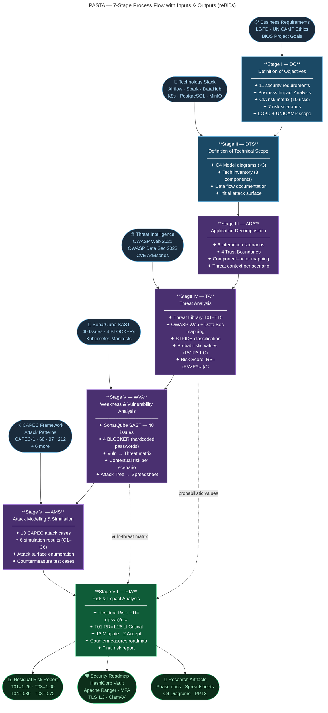

```mermaid
---
title: "PASTA — 7-Stage Process Flow with Inputs & Outputs (reBi0s)"
---
flowchart TD
    %% ─── INPUTS EXTERNOS ───
    REQS([📋 Business Requirements\nLGPD · UNICAMP Ethics\nBIOS Project Goals])
    STACK([🔧 Technology Stack\nAirflow · Spark · DataHub\nK8s · PostgreSQL · MinIO])
    INTEL([🌐 Threat Intelligence\nOWASP Web 2021\nOWASP Data Sec 2023\nCVE Advisories])
    SONAR([🔬 SonarQube SAST\n40 Issues · 4 BLOCKERs\nKubernetes Manifests])
    CAPEC_IN([⚔️ CAPEC Framework\nAttack Patterns\nCAPEC-1 · 66 · 97 · 212\n+ 6 more])

    %% ─── STAGE I ───
    S1["**Stage I — DO**\nDefinition of Objectives\n───────────────────\n✦ 11 security requirements\n✦ Business Impact Analysis\n✦ CIA risk matrix (10 risks)\n✦ 7 risk scenarios\n✦ LGPD + UNICAMP scope"]

    %% ─── STAGE II ───
    S2["**Stage II — DTS**\nDefinition of Technical Scope\n───────────────────\n✦ C4 Model diagrams (×3)\n✦ Tech inventory (8 components)\n✦ Data flow documentation\n✦ Initial attack surface"]

    %% ─── STAGE III ───
    S3["**Stage III — ADA**\nApplication Decomposition\n───────────────────\n✦ 6 interaction scenarios\n✦ 4 Trust Boundaries\n✦ Component–actor mapping\n✦ Threat context per scenario"]

    %% ─── STAGE IV ───
    S4["**Stage IV — TA**\nThreat Analysis\n───────────────────\n✦ Threat Library T01–T15\n✦ OWASP Web + Data Sec mapping\n✦ STRIDE classification\n✦ Probabilistic values (PV·PA·I·C)\n✦ Risk Score: RS=(PV×PA×I)/C"]

    %% ─── STAGE V ───
    S5["**Stage V — WVA**\nWeakness & Vulnerability Analysis\n───────────────────\n✦ SonarQube SAST — 40 issues\n✦ 4 BLOCKER (hardcoded passwords)\n✦ Vuln → Threat matrix\n✦ Contextual risk per scenario\n✦ Attack Tree → Spreadsheet"]

    %% ─── STAGE VI ───
    S6["**Stage VI — AMS**\nAttack Modeling & Simulation\n───────────────────\n✦ 10 CAPEC attack cases\n✦ 6 simulation results (C1–C6)\n✦ Attack surface enumeration\n✦ Countermeasure test cases"]

    %% ─── STAGE VII ───
    S7["**Stage VII — RIA**\nRisk & Impact Analysis\n───────────────────\n✦ Residual Risk: RR=[(tp×vp)/c]×i\n✦ T01 RR=1.26 🔴 Critical\n✦ 13 Mitigate · 2 Accept\n✦ Countermeasures roadmap\n✦ Final risk report"]

    %% ─── OUTPUTS FINAIS ───
    OUT1([📊 Residual Risk Report\nT01=1.26 · T03=1.00\nT04=0.89 · T08=0.72])
    OUT2([🛡️ Security Roadmap\nHashiCorp Vault\nApache Ranger · MFA\nTLS 1.3 · ClamAV])
    OUT3([📁 Research Artifacts\nPhase docs · Spreadsheets\nC4 Diagrams · PPTX])

    %% ─── CONNECTIONS ───
    REQS --> S1
    S1 --> S2
    STACK --> S2
    S2 --> S3
    S3 --> S4
    INTEL --> S4
    S4 --> S5
    SONAR --> S5
    S5 --> S6
    CAPEC_IN --> S6
    S6 --> S7
    S4 -.->|probabilistic values| S7
    S5 -.->|vuln-threat matrix| S7
    S7 --> OUT1
    S7 --> OUT2
    S7 --> OUT3

    %% ─── STYLES ───
    classDef business  fill:#1B4965,stroke:#5FA8D3,stroke-width:1.5px,color:#fff
    classDef technical fill:#4A3070,stroke:#9B72CF,stroke-width:1.5px,color:#fff
    classDef risk      fill:#0F5C38,stroke:#3DC47E,stroke-width:1.5px,color:#fff
    classDef input     fill:#1A2B3C,stroke:#5FA8D3,stroke-width:1px,color:#A8D5F0
    classDef output    fill:#0D2E1A,stroke:#3DC47E,stroke-width:1px,color:#A8E6C0

    class S1,S2 business
    class S3,S4,S5,S6 technical
    class S7 risk
    class REQS,STACK,INTEL,SONAR,CAPEC_IN input
    class OUT1,OUT2,OUT3 output
```
