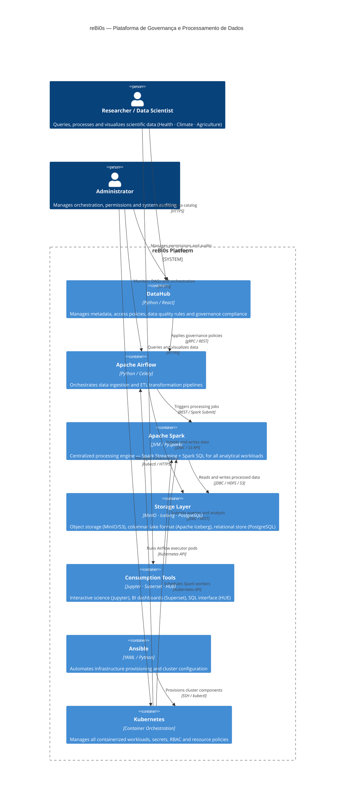

---

> **Stage II — Methodological Note**
>
> Standard PASTA methodology calls for UML Data Flow Diagrams (Level 0–3).
> For reBi0s, these were replaced by **C4 Model diagrams** at three levels:
>
> | C4 Level | File | Scope |
> |----------|------|-------|
> | System Context | `docs/images/diagrama1-system-context.png` | Researcher ↔ Platform |
> | Container | `docs/images/diagrama2-container.png` + this diagram | All containers & relations |
> | Component | `docs/images/diagrama3-component-spark.png` | Apache Spark internals |
>
> **Rationale:** C4 diagrams are better suited to distributed data architectures,
> provide natural Trust Boundary demarcation, and facilitate communication
> across technical and non-technical stakeholders.
