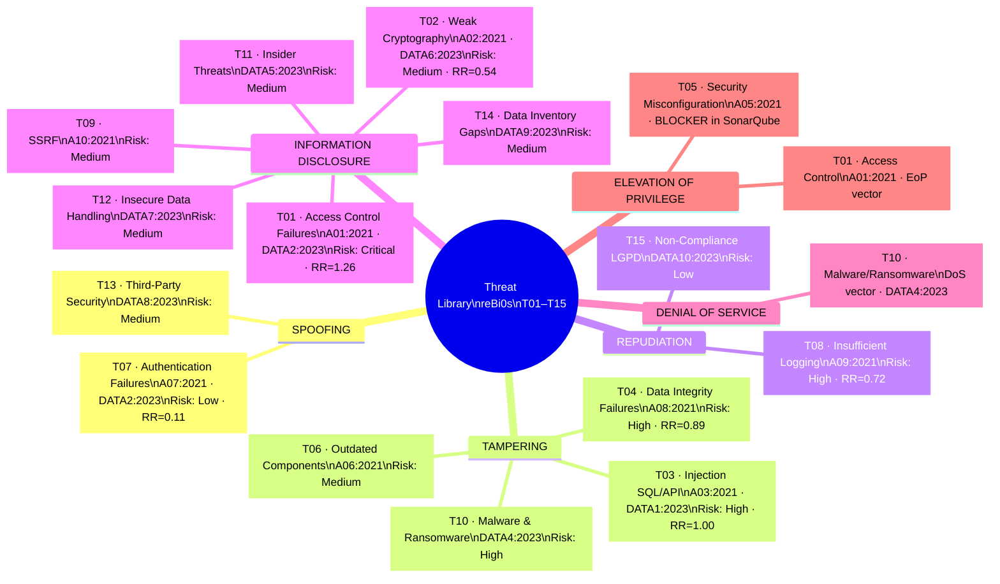
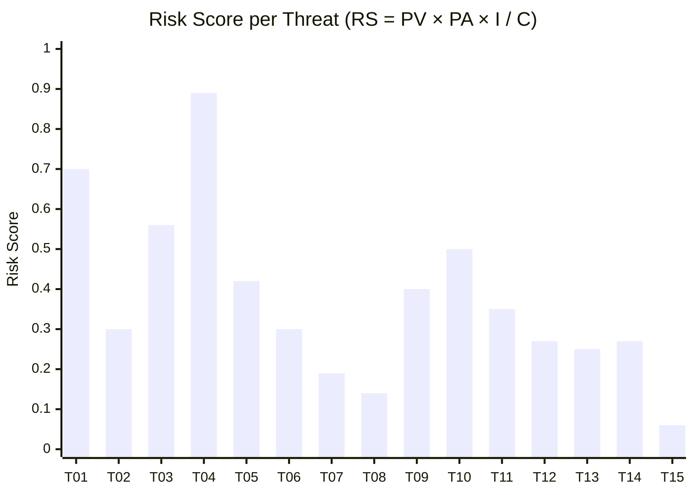
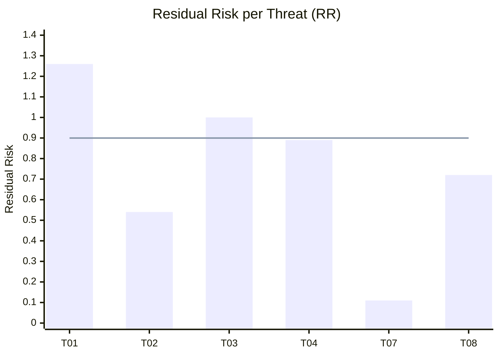

---

---

> **Reading the chart:** The horizontal line at 0.90 represents the Critical threshold.
> T01 (1.26) and T03 (1.00) exceed even this level, confirming critical priority status.
> Both originate from hardcoded credentials identified by SonarQube (BLOCKER severity).
