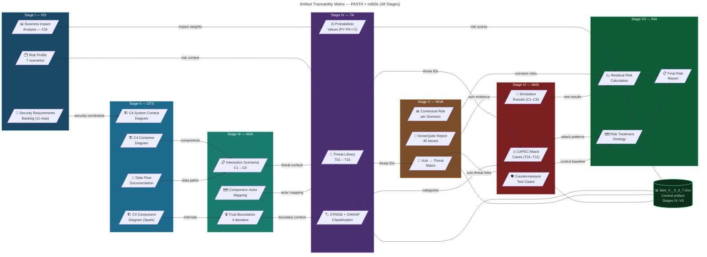

```mermaid
---
title: "Artifact Traceability Matrix — PASTA × reBi0s (All Stages)"
---
flowchart LR
    %% ── ARTIFACTS PER STAGE ──
    subgraph S1["Stage I — DO"]
        direction TB
        A1a[/"📄 Security Requirements\nBacklog (11 reqs)"/]
        A1b[/"📊 Business Impact\nAnalysis — CIA"/]
        A1c[/"🗂️ Risk Profile\n7 scenarios"/]
    end

    subgraph S2["Stage II — DTS"]
        direction TB
        A2a[/"🏗️ C4 System Context\nDiagram"/]
        A2b[/"🏗️ C4 Container\nDiagram"/]
        A2c[/"🏗️ C4 Component\nDiagram (Spark)"/]
        A2d[/"📐 Data Flow\nDocumentation"/]
    end

    subgraph S3["Stage III — ADA"]
        direction TB
        A3a[/"📋 Interaction Scenarios\nC1 – C6"/]
        A3b[/"🔒 Trust Boundaries\n4 domains"/]
        A3c[/"🗺️ Component–Actor\nMapping"/]
    end

    subgraph S4["Stage IV — TA"]
        direction TB
        A4a[/"📑 Threat Library\nT01 – T15"/]
        A4b[/"⚖️ Probabilistic\nValues (PV·PA·I·C)"/]
        A4c[/"🏷️ STRIDE + OWASP\nClassification"/]
    end

    subgraph S5["Stage V — WVA"]
        direction TB
        A5a[/"🔬 SonarQube Report\n40 issues"/]
        A5b[/"🔗 Vuln → Threat\nMatrix"/]
        A5c[/"📊 Contextual Risk\nper Scenario"/]
    end

    subgraph S6["Stage VI — AMS"]
        direction TB
        A6a[/"⚔️ CAPEC Attack\nCases (T01–T11)"/]
        A6b[/"🧪 Simulation\nResults (C1–C6)"/]
        A6c[/"🛡️ Countermeasure\nTest Cases"/]
    end

    subgraph S7["Stage VII — RIA"]
        direction TB
        A7a[/"📉 Residual Risk\nCalculation"/]
        A7b[/"🗺️ Risk Treatment\nStrategy"/]
        A7c[/"📋 Final Risk\nReport"/]
    end

    %% ── TRACEABILITY ARROWS ──
    A1a -->|security constraints| A2a
    A1b -->|impact weights| A4b
    A1c -->|risk context| A4a

    A2b -->|components| A3a
    A2c -->|internals| A3b
    A2d -->|data paths| A3a

    A3a -->|threat surface| A4a
    A3b -->|boundary context| A4c
    A3c -->|actor mapping| A4a

    A4a -->|threat IDs| A5b
    A4a -->|threat IDs| A6a
    A4b -->|risk scores| A7a
    A4c -->|categories| A6a

    A5a -->|vuln evidence| A6b
    A5b -->|vuln-threat links| A6a
    A5c -->|scenario risks| A7a

    A6a -->|attack patterns| A7b
    A6b -->|test results| A7a
    A6c -->|control baseline| A7b

    A7a --> A7c
    A7b --> A7c

    %% ── SPREADSHEET CROSSCUT ──
    XLSX[("📊 fase_4__5_6_7.xlsx\nCentral artifact\nStages IV–VII")]
    A4a --- XLSX
    A5b --- XLSX
    A6a --- XLSX
    A7a --- XLSX

    %% ── STYLES ──
    classDef s1box fill:#1B4965,stroke:#5FA8D3,color:#fff
    classDef s2box fill:#1D6A8C,stroke:#5FA8D3,color:#fff
    classDef s3box fill:#1A7A6E,stroke:#3DC47E,color:#fff
    classDef s4box fill:#4A3070,stroke:#9B72CF,color:#fff
    classDef s5box fill:#7A4E2A,stroke:#D4A070,color:#fff
    classDef s6box fill:#7A2020,stroke:#E07070,color:#fff
    classDef s7box fill:#0F5C38,stroke:#3DC47E,color:#fff
    classDef xlsx  fill:#0D2E1A,stroke:#3DC47E,stroke-width:2px,color:#A8E6C0

    class S1 s1box
    class S2 s2box
    class S3 s3box
    class S4 s4box
    class S5 s5box
    class S6 s6box
    class S7 s7box
    class XLSX xlsx
```
