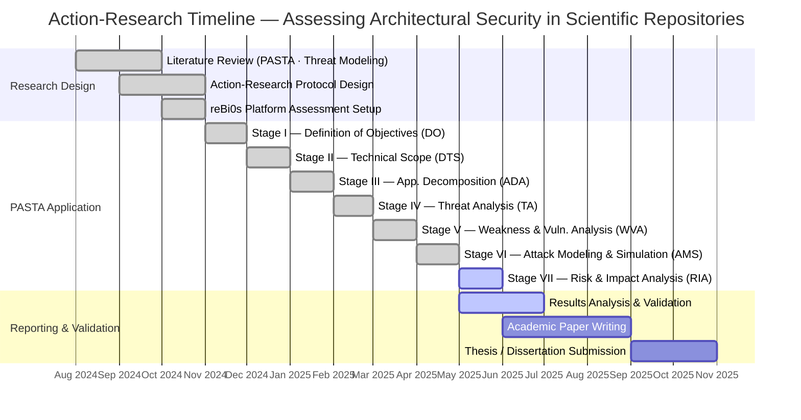

```mermaid
---
title: "Action-Research Timeline — Assessing Architectural Security in Scientific Repositories"
---
gantt
    dateFormat  YYYY-MM
    axisFormat  %b %Y

    section Research Design
    Literature Review (PASTA · Threat Modeling)   :done,    lit,   2024-08, 2024-10
    Action-Research Protocol Design               :done,    prot,  2024-09, 2024-11
    reBi0s Platform Assessment Setup             :done,    setup, 2024-10, 2024-11

    section PASTA Application
    Stage I — Definition of Objectives (DO)       :done,    s1,    2024-11, 2024-12
    Stage II — Technical Scope (DTS)              :done,    s2,    2024-12, 2025-01
    Stage III — App. Decomposition (ADA)          :done,    s3,    2025-01, 2025-02
    Stage IV — Threat Analysis (TA)               :done,    s4,    2025-02, 2025-03
    Stage V — Weakness & Vuln. Analysis (WVA)    :done,    s5,    2025-03, 2025-04
    Stage VI — Attack Modeling & Simulation (AMS) :done,    s6,    2025-04, 2025-05
    Stage VII — Risk & Impact Analysis (RIA)      :active,  s7,    2025-05, 2025-06

    section Reporting & Validation
    Results Analysis & Validation                 :active,  val,   2025-05, 2025-07
    Academic Paper Writing                        :         paper, 2025-06, 2025-09
    Thesis / Dissertation Submission              :         thesis,2025-09, 2025-11
```

---

```mermaid
---
title: "Action-Research Cycles — PASTA Application to reBi0s"
---
flowchart TD
    %% ─── RESEARCH CONTEXT ───
    CONTEXT["🎓 Research Context\nUNICAMP — Instituto de Computação\n──────────────────────────────\nResearcher: Maria Victoria Soares Fiori\nAdvisor: Prof. Dr. Breno B. N. de França\nCo-Advisor: Prof. Dr. José A. D'Abruzzo Pereira\n──────────────────────────────\nTitle: Assessing Architectural Security in\nScientific Repositories: An Action-Research Approach"]

    %% ─── ACTION RESEARCH CYCLES ───
    PLAN1["🔵 Cycle 1 — PLAN\nDefine PASTA application protocol\nIdentify reBi0s security objectives\nEstablish evaluation criteria"]
    ACT1["🟢 Cycle 1 — ACT\nApply Stages I, II, III\nProduce C4 diagrams\nDocument interaction scenarios"]
    OBS1["🟡 Cycle 1 — OBSERVE\nValidate architecture understanding\nReview Trust Boundaries\nCollect stakeholder feedback"]
    REF1["🔴 Cycle 1 — REFLECT\nAdjust scope based on feedback\nRefinement of threat surface\nAdaptation decisions logged"]

    PLAN2["🔵 Cycle 2 — PLAN\nDesign threat identification protocol\nSelect OWASP + STRIDE frameworks\nConfigure SonarQube analysis"]
    ACT2["🟢 Cycle 2 — ACT\nApply Stages IV, V\nBuild Threat Library T01–T15\nRun SonarQube — 40 issues"]
    OBS2["🟡 Cycle 2 — OBSERVE\nCorrelate vulnerabilities to threats\n4 BLOCKER issues confirmed\nContextual risk per scenario"]
    REF2["🔴 Cycle 2 — REFLECT\nRefine risk formula application\nValidate Attack Tree adaptation\nUpdate spreadsheet structure"]

    PLAN3["🔵 Cycle 3 — PLAN\nDesign simulation protocol\nMap CAPEC attack patterns\nDefine residual risk criteria"]
    ACT3["🟢 Cycle 3 — ACT\nApply Stages VI, VII\n6 attack simulations (C1–C6)\nCalculate residual risk"]
    OBS3["🟡 Cycle 3 — OBSERVE\nT01 RR=1.26 — Critical priority\nCountermeasures evaluated\n13 Mitigate · 2 Accept"]
    REF3["🔴 Cycle 3 — REFLECT\nAssess PASTA applicability\nDocument methodological adaptations\nPrepare final risk report"]

    %% ─── OUTPUT ───
    OUTPUT["📄 Research Output\n──────────────────────────────\n✦ PASTA applied to a Big Data scientific repository\n✦ 15 threats catalogued with quantified risk\n✦ 40 real vulnerabilities identified (SonarQube)\n✦ 5 methodological adaptations documented\n✦ Reusable artifact set for future research"]

    %% ─── FLOW ───
    CONTEXT --> PLAN1
    PLAN1 --> ACT1 --> OBS1 --> REF1
    REF1 --> PLAN2
    PLAN2 --> ACT2 --> OBS2 --> REF2
    REF2 --> PLAN3
    PLAN3 --> ACT3 --> OBS3 --> REF3
    REF3 --> OUTPUT

    %% ─── STYLES ───
    classDef ctx    fill:#0D1B2A,stroke:#5FA8D3,stroke-width:2px,color:#A8D5F0
    classDef plan   fill:#1B4965,stroke:#5FA8D3,color:#fff
    classDef act    fill:#1A7A4A,stroke:#3DC47E,color:#fff
    classDef obs    fill:#7A6820,stroke:#D4C040,color:#fff
    classDef ref    fill:#7A2020,stroke:#E07070,color:#fff
    classDef out    fill:#0F5C38,stroke:#3DC47E,stroke-width:2px,color:#A8E6C0

    class CONTEXT ctx
    class PLAN1,PLAN2,PLAN3 plan
    class ACT1,ACT2,ACT3 act
    class OBS1,OBS2,OBS3 obs
    class REF1,REF2,REF3 ref
    class OUTPUT out
```
