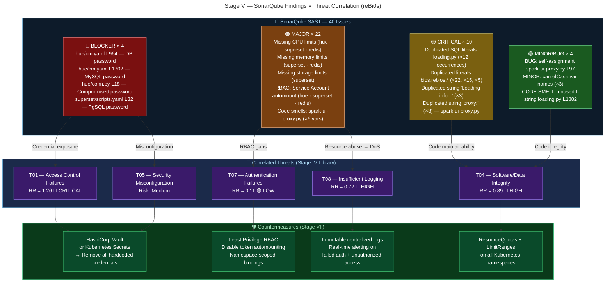
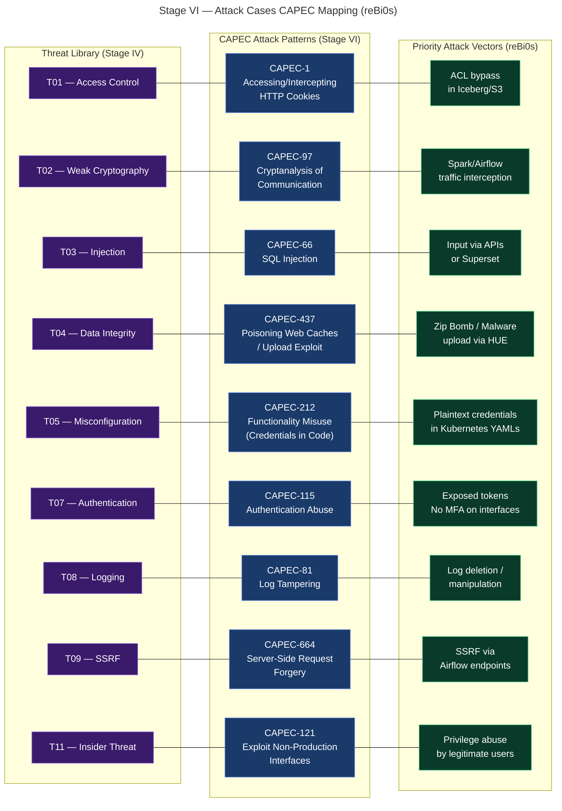

```mermaid
---
title: "Stage V — SonarQube Findings × Threat Correlation (reBi0s)"
---
flowchart TD
    subgraph SONAR["🔬 SonarQube SAST — 40 Issues"]
        direction LR
        B1["🔴 BLOCKER × 4\nhue/cm.yaml L964 — DB password\nhue/cm.yaml L1702 — MySQL password\nhue/conn.py L18 — Compromised password\nsuperset/scripts.yaml L32 — PgSQL password"]
        M1["🟠 MAJOR × 22\nMissing CPU limits (hue · superset · redis)\nMissing memory limits (superset · redis)\nMissing storage limits (superset)\nRBAC: Service Account automount (hue · superset · redis)\nCode smells: spark-ui-proxy.py (×6 vars)"]
        C1["🟡 CRITICAL × 10\nDuplicated SQL literals loading.py (×12 occurrences)\nDuplicated literals bios.rebios.* (×22, ×15, ×5)\nDuplicated string 'Loading info...' (×3)\nDuplicated string 'proxy:' (×3) — spark-ui-proxy.py"]
        N1["🟢 MINOR/BUG × 4\nBUG: self-assignment spark-ui-proxy.py L97\nMINOR: camelCase var names (×3)\nCODE SMELL: unused f-string loading.py L1882"]
    end

    subgraph THREATS["🎯 Correlated Threats (Stage IV Library)"]
        T01["T01 — Access Control Failures\nRR = 1.26 🔴 CRITICAL"]
        T04["T04 — Software/Data Integrity\nRR = 0.89 🔴 HIGH"]
        T05["T05 — Security Misconfiguration\nRisk: Medium"]
        T07["T07 — Authentication Failures\nRR = 0.11 🟢 LOW"]
        T08["T08 — Insufficient Logging\nRR = 0.72 🔴 HIGH"]
    end

    subgraph COUNTER["🛡️ Countermeasures (Stage VII)"]
        C_VAULT["HashiCorp Vault\nor Kubernetes Secrets\n→ Remove all hardcoded credentials"]
        C_RBAC["Least Privilege RBAC\nDisable token automounting\nNamespace-scoped bindings"]
        C_LIMITS["ResourceQuotas + LimitRanges\non all Kubernetes namespaces"]
        C_LOGS["Immutable centralized logs\nReal-time alerting on\nfailed auth + unauthorized access"]
    end

    B1 -->|"Credential exposure"| T01
    B1 -->|"Misconfiguration"| T05
    M1 -->|"RBAC gaps"| T07
    M1 -->|"Resource abuse → DoS"| T08
    C1 -->|"Code maintainability"| T04
    N1 -->|"Code integrity"| T04

    T01 --> C_VAULT
    T05 --> C_VAULT
    T07 --> C_RBAC
    T08 --> C_LOGS
    T04 --> C_LIMITS

    classDef blocker fill:#7A1010,stroke:#E07070,color:#fff
    classDef major   fill:#7A4010,stroke:#E0A070,color:#fff
    classDef critical fill:#7A6010,stroke:#E0D070,color:#fff
    classDef minor   fill:#1A5A20,stroke:#70E090,color:#fff
    classDef threat  fill:#3A1A6A,stroke:#9070E0,color:#fff
    classDef counter fill:#0A4A2A,stroke:#40C070,color:#fff
    classDef sonarbox fill:#0D1B2A,stroke:#5FA8D3,color:#A8D5F0
    classDef tbox fill:#1B2A4A,stroke:#5FA8D3,color:#A8D5F0
    classDef cbox fill:#0A3A1A,stroke:#3DC47E,color:#A8E6C0

    class B1 blocker
    class M1 major
    class C1 critical
    class N1 minor
    class T01,T04,T05,T07,T08 threat
    class C_VAULT,C_RBAC,C_LIMITS,C_LOGS counter
    class SONAR sonarbox
    class THREATS tbox
    class COUNTER cbox
```

---

```mermaid
---
title: "Stage VI — Attack Cases CAPEC Mapping (reBi0s)"
---
flowchart LR
    subgraph THREATS["Threat Library (Stage IV)"]
        direction TB
        T01L["T01 — Access Control"]
        T02L["T02 — Weak Cryptography"]
        T03L["T03 — Injection"]
        T04L["T04 — Data Integrity"]
        T05L["T05 — Misconfiguration"]
        T07L["T07 — Authentication"]
        T08L["T08 — Logging"]
        T09L["T09 — SSRF"]
        T11L["T11 — Insider Threat"]
    end

    subgraph CAPEC["CAPEC Attack Patterns (Stage VI)"]
        direction TB
        CP1["CAPEC-1\nAccessing/Intercepting\nHTTP Cookies"]
        CP97["CAPEC-97\nCryptanalysis of\nCommunication"]
        CP66["CAPEC-66\nSQL Injection"]
        CP437["CAPEC-437\nPoisoning Web Caches\n/ Upload Exploit"]
        CP212["CAPEC-212\nFunctionality Misuse\n(Credentials in Code)"]
        CP115["CAPEC-115\nAuthentication Abuse"]
        CP81["CAPEC-81\nLog Tampering"]
        CP664["CAPEC-664\nServer-Side Request\nForgery"]
        CP121["CAPEC-121\nExploit Non-Production\nInterfaces"]
    end

    subgraph VECTORS["Priority Attack Vectors (reBi0s)"]
        direction TB
        V1["ACL bypass\nin Iceberg/S3"]
        V2["Spark/Airflow\ntraffic interception"]
        V3["Input via APIs\nor Superset"]
        V4["Zip Bomb / Malware\nupload via HUE"]
        V5["Plaintext credentials\nin Kubernetes YAMLs"]
        V7["Exposed tokens\nNo MFA on interfaces"]
        V8["Log deletion /\nmanipulation"]
        V9["SSRF via\nAirflow endpoints"]
        V11["Privilege abuse\nby legitimate users"]
    end

    T01L --- CP1  --- V1
    T02L --- CP97 --- V2
    T03L --- CP66 --- V3
    T04L --- CP437 --- V4
    T05L --- CP212 --- V5
    T07L --- CP115 --- V7
    T08L --- CP81  --- V8
    T09L --- CP664 --- V9
    T11L --- CP121 --- V11

    classDef thr fill:#3A1A6A,stroke:#9070E0,color:#fff
    classDef cap fill:#1A3A6A,stroke:#7090E0,color:#fff
    classDef vec fill:#0A3A2A,stroke:#40C080,color:#fff

    class T01L,T02L,T03L,T04L,T05L,T07L,T08L,T09L,T11L thr
    class CP1,CP97,CP66,CP437,CP212,CP115,CP81,CP664,CP121 cap
    class V1,V2,V3,V4,V5,V7,V8,V9,V11 vec
```
